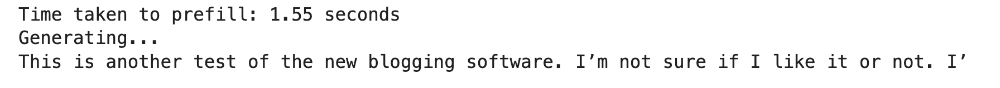

# Mistral-7B reference implementation JAX and Equinox

This repository contains a port of the original [Mistral-7B model](https://github.com/mistralai/mistral-src/tree/main?tab=readme-ov-file) in JAX and Equinox. The model here isn't pretrained or fine-tuned. The weights are ported from torch to jax, provided on an "as is" basis, without warranties or conditions of any kind.

Any official restriction, if applicable, that comes with the original code and the model, applies here as well. Please check the original license and the [repo](https://github.com/mistralai/mistral-src/tree/main?tab=readme-ov-file) for the details.

# Instructions to run the model

1. Clone the repo
2. Install the required packages `pip install -r requirements.txt`
3. Copy the mistral weights and other downloaded files to `mistral_jax/model_files/` directory
4. Run `python -m sample_generation.py` to generate

# Results
Here is a screenshot of the results I got on my side on a single A100 machine:

## References

[1] [Mistral 7B- Official code implementation](https://github.com/mistralai/mistral-src/tree/main?tab=readme-ov-file)

[2] [Generating Long Sequences with Sparse Transformers, Child et al. 2019](https://arxiv.org/pdf/1904.10509.pdf)

[3] [Longformer: The Long-Document Transformer, Beltagy et al. 2020](https://arxiv.org/pdf/2004.05150v2.pdf)
