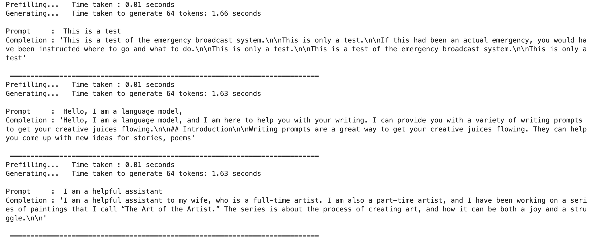

# Mistral-7B reference implementation JAX and Equinox

This repository contains a port of the original [Mistral-7B model](https://github.com/mistralai/mistral-src/tree/main?tab=readme-ov-file) in JAX and Equinox. The model here isn't pretrained or fine-tuned. The weights are ported from torch to jax, provided on an "as is" basis, without warranties or conditions of any kind.

Any official restriction, if applicable, that comes with the original code and the model, applies here as well. Please check the original license and the [repo](https://github.com/mistralai/mistral-src/tree/main?tab=readme-ov-file) for the details.

# Implementation details

There are two implementations that are provided in this reop. The first implementation is in [one_file_ref.py](./mistral_jax/one_file_ref.py) file, and it is a `1:1` mapping with the original model. If you are a `PyTorch` user, and you are trying out `JAX` and `Equinox` for the first time, it is highly recommended to use this file to learn the similarities, and the differences between the two. Beware, this code is simple, and is a bit slow! You will find one notebook [model_generation_simple.ipynb](./mistral_jax/model_generation_simple.ipynb) corresponding to this code that includes both the model and the text generation code.

On the other hand, if you are already familiar with JAX, it is recommended to look at the [model.py](./mistral_jax/model.py) file for the reference implementation, and [generation.py](./mistral_jax/generation.py) to use the ported model for generation. The notebook [model_generation_optimized.ipynb](./mistral_jax/model_generation_optimized.ipynb) can be used as a reference to check the results.

# Instructions to run the code

Please refer to the detailed instructions provided [here](./instructions.md) for running the code on your machine.
Given that the original model and the corresponding port are in `bfloat16`, you will require to have at least 16G GPU memory to run this model.

# Results
Here is a screenshot of the results I got on my side on a single A100 machine:

## References

[1] [Mistral 7B- Official code implementation](https://github.com/mistralai/mistral-src/tree/main?tab=readme-ov-file)

[2] [Generating Long Sequences with Sparse Transformers, Child et al. 2019](https://arxiv.org/pdf/1904.10509.pdf)

[3] [Longformer: The Long-Document Transformer, Beltagy et al. 2020](https://arxiv.org/pdf/2004.05150v2.pdf)
